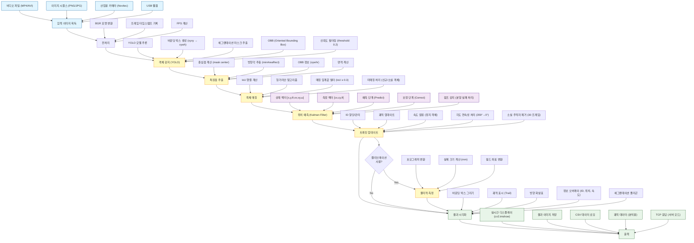

# AMR Tracking 시스템 파이프라인

## 전체 파이프라인 플로우



## 주요 구성 요소

### 1. 입력 이미지 획득
- **비디오 파일**: MP4, AVI, MKV 등
- **이미지 시퀀스**: PNG, JPG 연속 이미지
- **산업용 카메라**: Novitec 카메라 (TCP/IP)
- **USB 웹캠**: 일반 USB 카메라

### 2. 전처리
- BGR 포맷 변환
- 프레임 타임스탬프 기록
- 실시간 FPS 계산

### 3. 객체 감지 (YOLO)
- **YOLO 모델 추론**: Ultralytics YOLO 사용
- **바운딩 박스**: xyxy → xywh 변환
- **세그멘테이션 마스크**: 객체 윤곽선 추출
- **OBB (Oriented Bounding Box)**: 회전된 바운딩 박스
- **신뢰도 필터링**: 기본 임계값 0.2

### 4. 특징점 추출
- **중심점**: 마스크 중심 또는 바운딩 박스 중심
- **방향각**: minAreaRect 또는 OBB에서 추출
- **면적**: 바운딩 박스 면적 계산

### 5. 객체 매칭
- **IoU 행렬**: 모든 감지-추적자 쌍의 IoU 계산
- **헝가리안 알고리즘**: 최적 할당 (scipy.optimize.linear_sum_assignment)
- **매칭 필터**: IoU ≥ 0.3인 쌍만 매칭
- **미매칭 처리**:
  - 신규 객체: 새 추적자 생성
  - 소실 객체: 추적자 유지 또는 제거

### 6. 위치 예측 (Kalman Filter)
- **상태 벡터** (6D): [x, y, θ, vx, vy, ω]
  - x, y: 위치 (픽셀)
  - θ: 방향각 (도)
  - vx, vy: 선속도 (픽셀/프레임)
  - ω: 각속도 (도/프레임)
- **측정 벡터** (3D): [cx, cy, θ]
- **예측 단계**: 운동 모델 기반 예측
- **보정 단계**: 측정값으로 상태 보정
- **점프 감지**: 세그멘테이션 실패 시 이전 위치 사용

### 7. 트래킹 업데이트
- **ID 할당/관리**: 고유 ID 부여 및 관리
- **궤적 업데이트**: 위치 히스토리 저장
- **속도 댐핑**: 정지 객체의 속도를 0으로 수렴
- **각도 연속성**: 359° → 0° 래핑 처리
- **소실 추적자 제거**: 30 프레임 이상 미감지 시 제거

### 8. 물리적 측정 (선택적)
캘리브레이션 데이터가 있을 경우:
- **호모그래피 변환**: 이미지 → 월드 좌표
- **실제 크기 계산**: 폭, 높이, 면적 (mm 단위)
- **월드 좌표**: 실제 위치 변환

### 9. 결과 시각화
- 바운딩 박스 그리기
- 궤적 표시 (Trail)
- 방향 화살표
- 정보 오버레이 (ID, 위치, 속도, 각도)
- 세그멘테이션 폴리곤

### 10. 출력
- **실시간 디스플레이**: cv2.imshow
- **결과 이미지**: 이벤트 발생 시 저장
- **CSV 로깅**: 추적 데이터 저장
- **궤적 데이터**: 반복성 분석용
- **TCP 응답**: 서버 모드에서 클라이언트로 전송

## 고급 기능

### 점프 감지 (Jump Detection)
세그멘테이션 실패로 인한 급격한 위치 변화를 감지하고 이전 예측값 사용

### 속도 댐핑 (Velocity Damping)
정지 중인 객체의 속도를 점진적으로 0으로 수렴

### 각도 연속성
359° → 0° 전환 시 불연속성 처리

### FPS 적응
실제 프레임 타임스탬프 기반으로 dt를 동적 계산

### 다중 카메라 지원
TCP 서버 모드에서 3개 독립 카메라 동시 추적

## 시스템 특징

- **모듈화 설계**: 감지, 추적, 측정, 시각화 분리
- **GPU 가속**: CUDA 지원
- **설정 기반**: JSON 설정 파일로 런타임 제어
- **강건성**: 세그멘테이션 실패, 객체 소실 등 예외 처리
- **확장성**: 새로운 감지기/추적기 플러그인 가능

## 파일 구조

```
AMR_Tracker/
├── main.py                          # 메인 실행 파일
├── vision_server.py                 # TCP 서버
├── src/
│   ├── core/
│   │   ├── detection/
│   │   │   ├── yolo_detector.py    # YOLO 감지기
│   │   │   └── detection.py        # 감지 객체
│   │   └── tracking/
│   │       ├── kalman_tracker.py   # 칼만 추적기
│   │       └── association.py      # 객체 매칭
│   ├── measurement/
│   │   └── size_measurement.py     # 물리 측정
│   └── utils/
│       ├── sequence_loader.py      # 입력 로더
│       └── visualizer.py           # 시각화
└── configs/
    └── tracker_config.json         # 설정 파일
```

## 사용 예시

### 단독 실행 모드
```bash
python main.py --source video.mp4 --model models/yolo_agv.pt
```

### 서버 모드
```bash
python run_server.py --config configs/server_config.json
```

## 참고 사항

이 시스템은 산업용 AMR (Autonomous Mobile Robot) 추적을 위해 특별히 설계되었으며, 실시간 성능과 정확도를 동시에 제공합니다.
